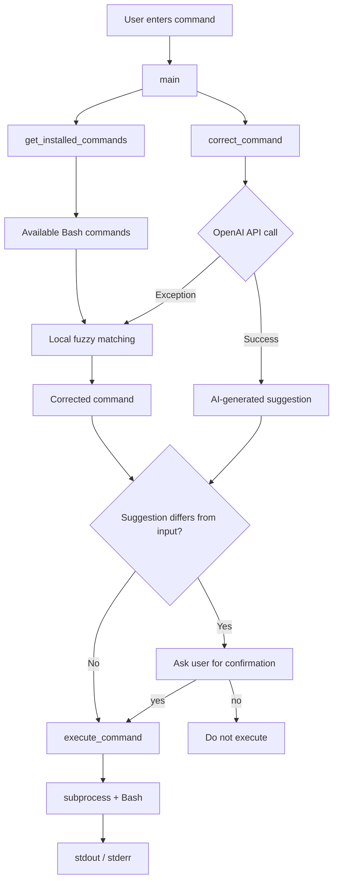
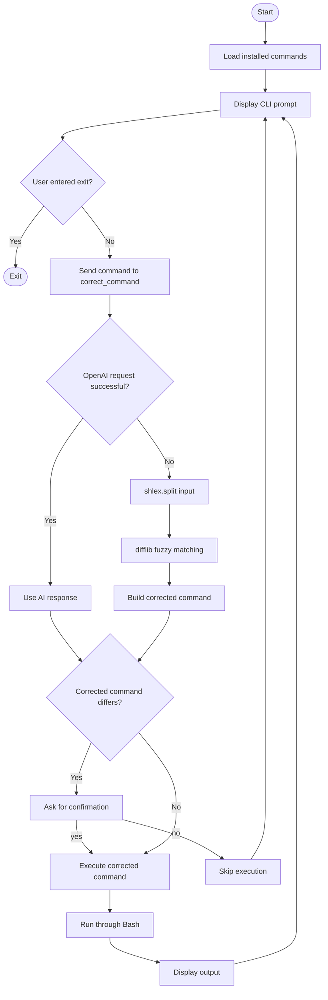
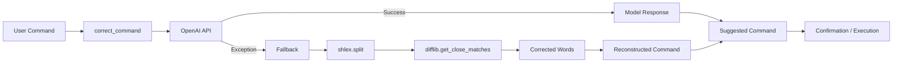
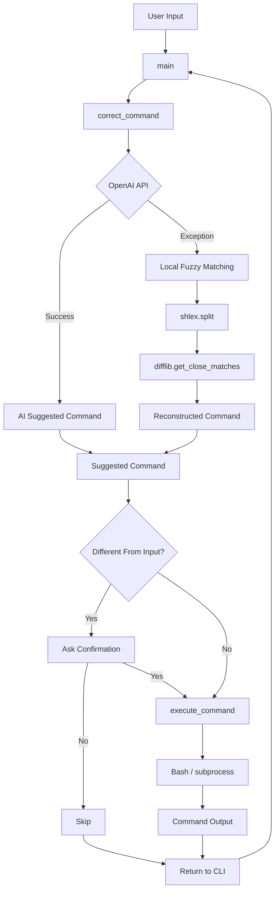

# 🤖 AI-Powered Terminal Assistant

> A lightweight Python CLI that uses OpenAI to suggest corrections for mistyped shell commands, with a local fuzzy-matching fallback when the API call fails.

[](https://www.python.org/)
[](https://platform.openai.com/)
[](LICENSE)

---

## 📌 Overview

**AI-Powered Terminal Assistant** is a Python-based command-line tool designed to help users correct mistyped or incorrectly entered shell commands.

The project combines:

- 🤖 OpenAI-powered command correction
- 🔎 Local fuzzy matching as a fallback
- 🐧 Bash command discovery
- ⚡ Real shell command execution
- 💬 Interactive CLI workflow
- 🛡️ User confirmation before executing corrected commands

The goal is to demonstrate how **AI + Python + Linux/Bash + fallback logic** can be combined into a practical command-line utility.

---

## ✨ Key Features

- 🤖 **AI Command Correction** using OpenAI's `gpt-3.5-turbo`
- 🔎 **Local Fuzzy Matching** using Python's `difflib`
- 🧰 **Installed Command Discovery** using Bash `compgen -c`
- ✅ **Confirmation Before Execution** of corrected commands
- 🐚 **Bash Execution** through Python `subprocess`
- 🔄 **Interactive Command Loop**
- 🛠️ **Basic Error Handling**
- 🔁 **Fallback Architecture** when the OpenAI API request fails

---

# 🏗️ Architecture



---

# 🔄 End-to-End Flow



---

# 🤖 AI + Local Fallback Architecture



---

# 🧠 How the AI Correction Works

The application sends the user's command to the OpenAI API.

The code uses:

```python
openai.ChatCompletion.create(
    model="gpt-3.5-turbo",
    ...
)
```

The returned message content is then used as the suggested command.

### Example

```text
### Example

User input:
gti status

Possible AI suggestion:
git status
```

If the API request fails, the application falls back to local fuzzy matching.

---

# 🔎 Local Fuzzy-Matching Fallback

The fallback mechanism does **not** use AI.

It works locally using Python's standard library.

### Process

1. `shlex.split()` parses the command.
2. Available shell commands are collected.
3. Individual words are compared with installed commands.
4. `difflib.get_close_matches()` searches for similar commands.
5. A sufficiently close match can replace the mistyped command.
6. The command is reconstructed.

### Example

```text
Input:
pytohn --version

Possible local correction:
python --version
```

This fallback is based on **string similarity**, not semantic understanding.

---

# 🧩 Core Components

| Component | Responsibility |
|---|---|
| `main()` | Runs the interactive CLI loop |
| `get_installed_commands()` | Retrieves available Bash commands |
| `correct_command()` | Uses OpenAI and fallback fuzzy matching |
| `execute_command()` | Executes the selected shell command |
| `subprocess` | Interfaces with the operating system |
| `difflib` | Performs fuzzy string matching |
| `shlex` | Parses command input during fallback |
| `openai` | Provides AI-powered command suggestions |

---

# 🛠️ Technology Stack

| Technology | Purpose |
|---|---|
| Python 3 | Core application |
| OpenAI API | AI command correction |
| GPT-3.5-Turbo | Language model |
| `subprocess` | Shell command execution |
| `difflib` | Fuzzy command matching |
| `shlex` | Command parsing |
| Bash | Shell environment and command discovery |

---

# 📁 Project Structure

```text
ai-terminal-assistant/
│
├── terminal_assistant.py
├── README.md
├── LICENSE
└── .gitignore
```

---

# ⚙️ How It Works

## 1. Application Starts

The application retrieves available shell commands using Bash:

```bash
compgen -c
```

These commands are later used by the local fallback mechanism.

---

## 2. User Enters a Command

Example:

```text
gti status
```

---

## 3. AI Attempts Correction

The command is sent to OpenAI.

Possible response:

```text
git status
```

---

## 4. API Failure Triggers Local Fallback

If the OpenAI request raises an exception, the application uses local fuzzy matching.

For example:

```text
pytohn --version
```

may be corrected to:

```text
python --version
```

depending on the installed commands and similarity match.

---

## 5. User Confirmation

If the suggested command differs from the original command, the user is asked whether it should be executed.

This adds an additional confirmation step before executing a corrected command.

---

## 6. Command Execution

The selected command is executed through:

```python
subprocess.run(
    ...,
    shell=True,
    executable="/bin/bash"
)
```

The command output is captured and displayed; if stdout is empty, stderr is displayed instead.

---

# 💻 Example Usage

### Example 1 — AI Correction

```text
$ python3 terminal_assistant.py

Enter command: gti status

Suggested command: git status

Execute suggested command? (yes/no): yes

[Git command output...]
```

---

### Example 2 — Rejecting a Suggestion

```text
Enter command: some-command

Suggested command: another-command

Execute suggested command? (yes/no): no
```

The suggested command is not executed.

---

### Example 3 — Normal Command

```text
Enter command: pwd

[Current working directory]
```

---

### Example 4 — Exit

```text
Enter command: exit
```

The interactive session terminates.

> AI-generated suggestions may vary depending on the model response.

---

# 🔐 Security Considerations

This project is intended primarily as a **learning/demo project** and should not be considered a hardened shell security tool.

The application executes commands using:

```python
shell=True
```

and:

```python
executable="/bin/bash"
```

Therefore, commands can potentially affect the host operating system.

### Important considerations

- AI-generated commands are **not sandboxed**.
- AI-generated commands are **not comprehensively validated** before execution.
- Shell commands can modify or delete files.
- Avoid running the application with unnecessary root privileges.
- Review suggested commands before approving them.
- Do not use the project as a production security boundary.

### API Key

The current implementation assigns the API key directly in the source code:

```python
openai.api_key = 'your-api-key-here'
```

A real API key should **never be committed to a public GitHub repository**.

If a real key is accidentally exposed, it should be revoked/rotated immediately.

A future improvement would be loading the key from an environment variable or secret manager.

---

# ⚠️ Limitations

### 1. Bash Dependency

The application depends on Bash features such as:

```bash
compgen -c
```

and:

```text
/bin/bash
```

It is therefore primarily suited to Linux/macOS Bash environments and compatible environments such as WSL.

It is not designed specifically for native Windows CMD or PowerShell.

---

### 2. OpenAI SDK Compatibility

The project currently uses the legacy OpenAI Python SDK interface:

```python
openai.ChatCompletion.create(...)
```

Therefore, it requires a compatible SDK version.

---

### 3. AI Output Is Not Fully Validated

The application does not implement comprehensive security or correctness validation for AI-generated commands.

Users should review commands before approving execution.

---

### 4. Fuzzy Matching Is Simple

The fallback uses string similarity.

It does not understand the semantic meaning of commands.

For example, it may identify a spelling correction but cannot reliably determine whether a command is appropriate for the user's intended task.

---

### 5. Interactive Terminal Programs

Programs requiring an interactive terminal session may not behave as expected because command output is captured by the Python process.

Examples include:

```text
vim
top
ssh
```

---

### 6. No Persistent Command History

The project does not currently maintain a dedicated persistent history database for corrected commands.

---

### 7. No Sandbox

Commands execute against the actual shell environment.

There is no containerized or isolated execution environment.

---

### 8. No Command Timeout

Long-running commands may continue running because the current implementation does not provide a dedicated execution timeout mechanism.

---

# ⚖️ AI Path vs Local Fallback

| Aspect | OpenAI Path | Local Fallback |
|---|---|---|
| Technology | OpenAI model | Python standard library |
| Main purpose | Intelligent command correction | Similarity-based correction |
| Internet/API | Requires API access | No internet required |
| API key | Required | Not required |
| Semantic understanding | Possible | No |
| Installed commands | Not directly required for the AI request | Used during matching |
| Main dependencies | OpenAI API + compatible SDK | `shlex` + `difflib` |

---

# 🛡️ Error Handling

The application includes basic error handling around its major operations.

### OpenAI API

If the API request raises an exception:

```text
OpenAI request
      ↓
Exception
      ↓
Fallback mechanism
```

The application can continue using the local fuzzy-matching approach.

### Command Discovery

If command discovery fails, the application continues with an empty command list, so the local fuzzy-matching fallback has no discovered commands to compare against.

### Command Execution

Execution errors are caught and displayed to the user rather than silently failing.

---

# 🚀 Installation

## Prerequisites

You should have:

- Python 3.x
- Git
- Bash-compatible environment
- Compatible OpenAI Python SDK
- OpenAI API key

---

## 1. Clone the Repository

```bash
git clone https://github.com/Khushi-dubey-dot/ai-terminal-assistant.git
cd ai-terminal-assistant
```

---

## 2. Create a Virtual Environment

Linux/macOS/WSL:

```bash
python3 -m venv venv
source venv/bin/activate
```

---

## 3. Install the OpenAI Dependency

The current implementation uses the legacy OpenAI SDK interface, so install a compatible version:

```bash
pip install "openai<1.0"
```

> The repository currently does not include a `requirements.txt` file.

---

## 4. Configure the API Key

The current implementation expects the key in the Python source:

```python
openai.api_key = 'your-api-key-here'
```

Replace the placeholder with your API key for local testing.

**Do not commit a real API key to GitHub.**

For a production-ready implementation, environment variables or a secret-management system should be used.

---

# ▶️ Run the Application

```bash
python3 terminal_assistant.py
```

You should see the interactive terminal assistant prompt.

Enter:

```text
exit
```

to terminate the application.

---

# 🧠 Design Decisions

## Why use AI?

Traditional fuzzy matching can identify spelling mistakes, but it does not understand the intent behind a command.

An AI model can provide more context-aware command suggestions.

---

## Why include a fallback?

External APIs can fail because of:

- Network problems
- API errors
- Authentication problems
- Service availability
- Rate limits

The local fallback allows the application to retain basic command-correction functionality without depending entirely on the API.

---

## Why ask for confirmation?

Shell commands can directly affect the operating system.

A confirmation step provides the user with an opportunity to review the suggested command before execution.

---

# 🏛️ High-Level System Architecture

```mermaid
graph TB
    U[User]

    subgraph CLI[Python CLI Application]
        M[main]
        C[correct_command]
        G[get_installed_commands]
        E[execute_command]
    end

    subgraph AI[AI Layer]
        O[OpenAI API]
    end

    subgraph LOCAL[Local Fallback]
        S[shlex]
        D[difflib]
        B[Bash command list]
    end

    subgraph OS[Operating System]
        SH[/bin/bash]
        OUT[Command Output]
    end

    U --> M
    M --> C
    M --> G
    G --> B

    C --> O
    O -->|Success| C
    O -->|Exception| S
    S --> D
    B --> D
    D --> C

    C --> E
    E --> SH
    SH --> OUT
    OUT --> U
```

---

# 🔁 Command Processing Pipeline



---

# 📚 What This Project Demonstrates

This project demonstrates practical knowledge of:

- 🐍 Python
- 💻 CLI application development
- 🤖 OpenAI API integration
- 🔌 External API handling
- 🔄 Fallback architecture
- 🔎 Fuzzy string matching
- 🐧 Linux/Bash
- 🧰 Shell command discovery
- ⚙️ Python `subprocess`
- 🔤 Python `shlex`
- 🛠️ Error handling
- 🔐 Basic command-execution security awareness
- 🔁 Interactive application design

---

# 🔮 Future Improvements

Potential improvements include:

- [ ] Move API key to environment variables
- [ ] Upgrade to the modern OpenAI Python SDK
- [ ] Add `requirements.txt`
- [ ] Add stronger command validation
- [ ] Add destructive-command detection
- [ ] Add configurable confirmation behavior
- [ ] Add command history
- [ ] Add unit and integration tests
- [ ] Add command execution timeout
- [ ] Improve fuzzy matching
- [ ] Support configurable AI providers
- [ ] Add local LLM support
- [ ] Add sandboxed command execution
- [ ] Improve native Windows support

---

# 🧪 Development

Clone the repository and create a virtual environment:

```bash
python3 -m venv venv
source venv/bin/activate
```

Install the required compatible OpenAI package:

```bash
pip install "openai<1.0"
```

Run the application:

```bash
python3 terminal_assistant.py
```

You can also perform a basic Python syntax check:

```bash
python3 -m py_compile terminal_assistant.py
```

---

# 🤝 Contributing

Contributions and suggestions are welcome.

1. Fork the repository
2. Create a feature branch
3. Make your changes
4. Test the changes locally
5. Commit your changes
6. Open a pull request

---

# 📄 License

This project is licensed under the **MIT License**.

See the [`LICENSE`](LICENSE) file for details.

---

# 👩‍💻 Author

**Khushi Dubey**

GitHub:  
https://github.com/Khushi-dubey-dot

---

# ⭐ Project Summary

**AI-Powered Terminal Assistant** is a compact Python CLI project that combines:

> **AI-powered command correction + local fuzzy matching + Bash integration + shell execution + user confirmation**

It demonstrates how an external AI service can be combined with a local fallback mechanism to build a more resilient command-line utility.
